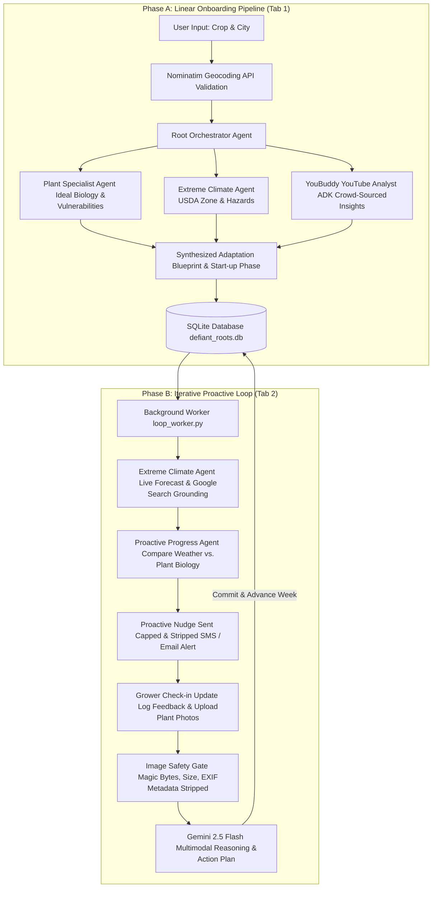

# Defiant Roots: Grow What You Love, Wherever You Are

A multi-agent, climate-adaptive gardening companion that helps urban growers and hobbyists cultivate "impossible" plants in non-native, harsh, or extreme environments by engineering low-cost micro-climate adaptation blueprints.

---

## 🌿 Project Overview

### Problem
Most gardening resources answer a simple question: **"Can this plant grow where I live?"**

However, successful growing depends on much more than USDA zones or ideal climates. Environmental conditions change throughout the season, plants experience different stresses over time, and beginners often struggle to translate general gardening advice into practical actions for their own unique environment.

Existing gardening applications typically provide static recommendations but rarely adapt as growing conditions evolve. As a result, users may abandon ambitious growing projects after encountering their first setback rather than learning how to adapt.

### Solution
**Defiant Roots** is a multi-agent gardening companion that helps users grow plants in challenging environments through personalized adaptation rather than one-time recommendations.

Instead of simply telling a user what grows naturally in their region, Defiant Roots analyzes the relationship between plant biology and local environmental conditions to generate practical, low-cost adaptation strategies tailored to the user's goals.

The platform continues supporting the grower throughout the season by:
* Creating personalized adaptation blueprints.
* Monitoring changing regional weather extremes.
* Providing proactive weekly check-ins via SMS/Email.
* Updating recommendations dynamically based on user feedback and photos.
* Encouraging experimentation and continuous learning.

In addition to AI-powered guidance, the **Plant Gossip** community board enables growers to share real-world experiences, lessons learned, and practical tips so the community grows alongside the plants.

---

## 🏗️ Architecture & Multi-Agent Workflow

Defiant Roots is built using a decoupled architecture divided into two distinct operational cycles: a linear **Onboarding Pipeline** (Tab 1) and an iterative **Proactive Loop** (Tab 2).



#### Architecture Diagram Visual


### 🧠 Multi-Agent Roles
1. **Root Orchestrator Agent**: Coordinates the multi-agent hierarchy, dispatches research requests, maps plant vulnerabilities against local climate hazards, and compiles the final plan of action.
2. **Plant Specialist Agent**: Researches botanical baselines, temperature thresholds, sunlight needs, and critical environmental vulnerabilities for target crops.
3. **Extreme Climate Agent**: Investigates regional hardiness zones and historical hazards. In the proactive loop, it queries live forecasts utilizing **Google Search Grounding**.
4. **Proactive Progress Agent**: Maintains long-term state, checks upcoming weather extremes against biological thresholds, drafts personalized text/email nudges, and analyzes user updates.
5. **YouBuddy YouTube Analyst**: A local agent integrated via Google's **Agent Development Kit (ADK)** that crawls YouTube videos to summarize crowd-sourced gardening tips and highlights conflicting community viewpoints.

---

## 🛡️ Security Guardrails & Production Best Practices
To ensure a secure, robust application suitable for evaluation, Defiant Roots incorporates the following security gates:
* **Image Upload Security**: 
  * Strict file size checks limit uploads to **5MB** to prevent denial-of-service (DoS) vectors.
  * **Magic Bytes Validation**: Verifies the MIME type using raw file headers (accepts only `image/png` and `image/jpeg`), bypassing easily forged file extensions.
  * **EXIF Metadata Removal**: Strips metadata (GPS tags, device info, camera profiles) from photos using Pillow before processing to protect user privacy.
* **XSS Safeguards**: Runs all community logs, questions, and replies through `bleach.clean` to strip out styling and script tags, neutralizing HTML injection vectors.
* **SQL Injection Prevention**: All queries to SQLite use parameterized query boundaries (`?` placeholders) instead of raw string concatenation.
* **Subprocess Arguments Escaping**: Subprocess invocations for YouBuddy CLI validate inputs against strict alphanumeric regex guidelines to prevent command injection.
* **Spam Rate Limiting**: Grower entries to the community Grapevine board are capped at **10 posts per day per user** to maintain data integrity.

#### Security Flow Diagram Visual


---

## ⚙️ Quick Start & Setup Instructions

### Prerequisites
* **Python 3.10+**
* SQLite3
* A **Gemini API Key** from [Google AI Studio](https://aistudio.google.com/)

### Installation
1. Clone this repository and navigate to the project directory:
   ```bash
   cd Defiant_Roots
   ```

2. Create and activate a Python virtual environment:
   ```bash
   python3 -m venv .venv
   source .venv/bin/activate
   ```

3. Install the dependencies:
   ```bash
   pip install -r requirements.txt
   ```

4. Create a `.env` file in the project root:
   ```env
   GEMINI_API_KEY=your_gemini_api_key_here
   YOUTUBE_API_KEY=your_optional_youtube_key_here
   ```

### Running the Project

#### 1. Run the Streamlit Application (Web App Dashboard)
Start the frontend dashboard:
```bash
streamlit run app.py
```
Open [http://localhost:8501](http://localhost:8501) in your browser.

* *Testing tip*: Click **"Sign in with Google"** in the sidebar to authenticate your profile.

#### 2. Run the Background Proactive Loop Worker
To simulate the background loop triggering weather forecast lookups and drafting SMS/Email nudges:
```bash
python3 loop_worker.py
```

* *Testing tip*: On Tab 2, click the **"Trigger Weekly Check-In Early"** button to execute the loop worker directly for your active crop.

#### 3. Run the YouBuddy CLI Search (Optional)
To query the YouTube Analyst CLI tool directly in the console:
```bash
python3 query_youbuddy_cli.py "growing mangos in dry desert zone 9"
```

---

## 🚀 Google Cloud Run Deployment (Option A: GCS FUSE Volume Mounts)

To deploy this project to Google Cloud Run with **Option A** (mounting a persistent Google Cloud Storage bucket to preserve your database and image uploads):

### 1. Create a Google Cloud Storage Bucket
Create a dedicated bucket in your Google Cloud project (e.g., `defiant-roots-db-storage`):
```bash
gcloud storage buckets create gs://YOUR_GCS_BUCKET_NAME --location=us-central1
```

### 2. Build and Deploy to Cloud Run with GCS Volume Mount
Run the following deployment command from the project root directory. This command mounts your GCS bucket as a folder inside the container at `/data` and sets the `DB_DIR` environment variable to write there:
```bash
gcloud beta run deploy defiant-roots \
    --source . \
    --region us-central1 \
    --allow-unauthenticated \
    --add-volume=name=db-volume,type=cloud-storage,bucket=YOUR_GCS_BUCKET_NAME \
    --add-volume-mount=volume=db-volume,mount-path=/data \
    --set-env-vars DB_DIR=/data,GEMINI_API_KEY=your_gemini_api_key_here,YOUTUBE_API_KEY=your_optional_youtube_key_here
```
*(Note: Cloud Storage volume mounts require using `gcloud beta run deploy`)*

### ⚠️ How Data Persistence Works
* **Stateless vs Persistent**: Cloud Run containers are stateless, but since we map `DB_DIR=/data` in the environment variables, both the SQLite database file (`defiant_roots.db`) and uploaded plant photos (`uploads/` folder) are written directly to GCS.
* **Persistent Sessions**: Even when the container instance scales down to zero or restarts, the next session will mount the same bucket and load the database files seamlessly, providing judges and users a persistent experience.

